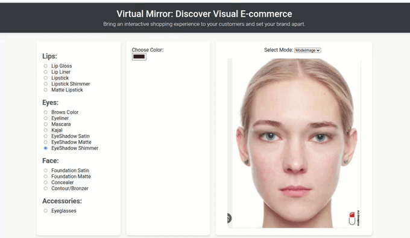
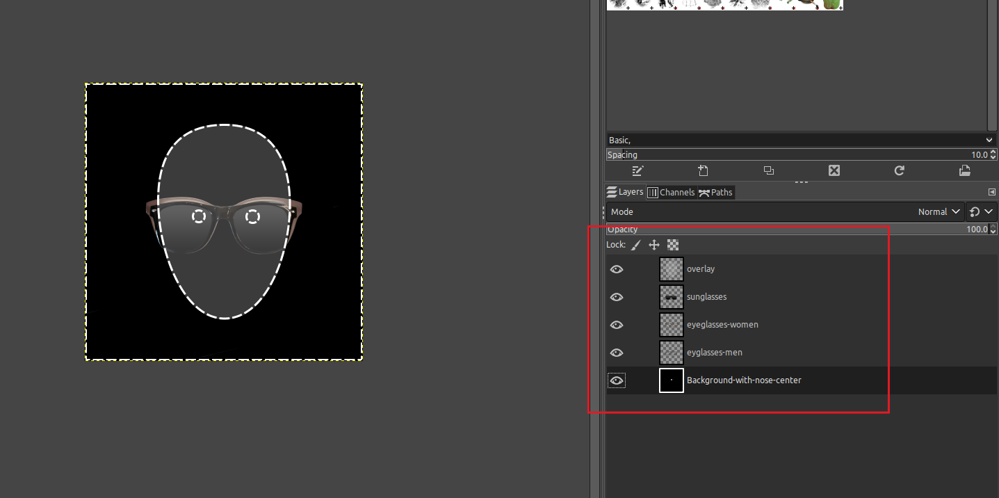
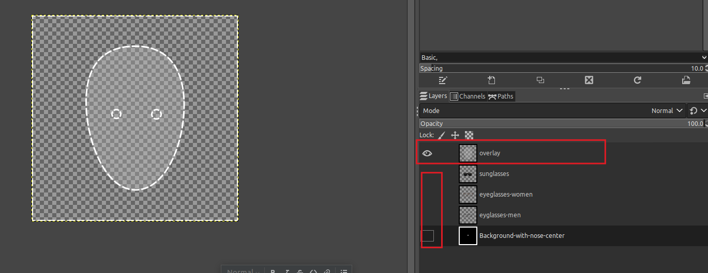
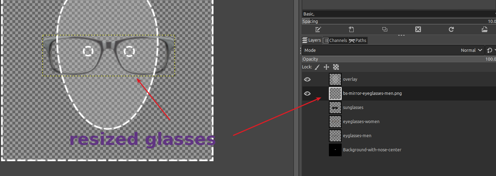
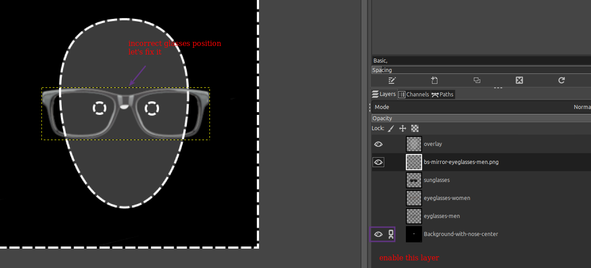
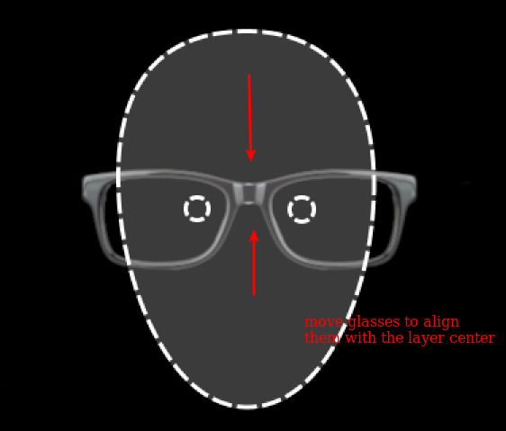
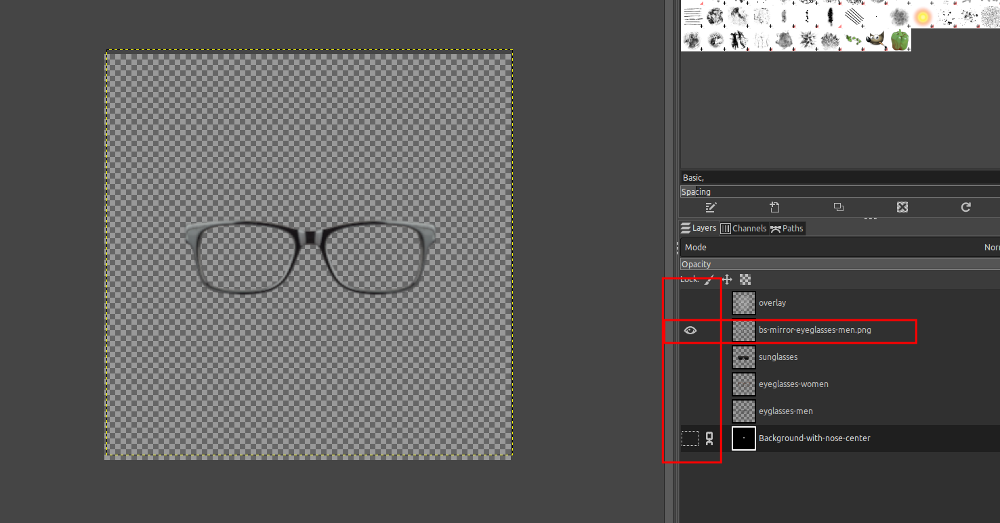

# Virtual Mirror - Library for Virtual Makeup



## Overview
The library allows users to see themselves wearing different cosmetics and accessorizes, 
just like they would in a physical mirror

Everything that you need is connect your website with this library.

The library can automatically check if a camera is available for the customer before using it.

## Features
* Real-time camera feed: the library uses the user's web camera to capture a real-time video feed of their face, 
allowing them to see themselves in real-time as they try on different cosmetics and accessorizes.

* Static Image effect applying: the library supports static image to apply makeup and accessorizes.

* Mobile-friendly: the library is optimized for mobile devices, making it easy for users to try on different looks on the go.

* Easy Integration: the library seamlessly integrates with your website.

* Increased Sales: By allowing customers to try products virtually, you'll build trust and boost sales 
as they can confidently make a purchase decision.

## Available in library:
The library supports a range of products for the virtual mirror:

- Lip Gloss
- Lip Liner 
- Lipstick
- Lipstick Shimmer
- Matte Lipstick
- Brows Color
- Eyeliner
- Mascara
- Kajal
- EyeShadow Satin
- EyeShadow Matte
- EyeShadow Shimmer
- Foundation Satin
- Foundation Matte
- Concealer
- Contour/Bronzer
- Eyeglasses

Offer your customers a comprehensive virtual try-on experience for various products.


## System requirements:

1) Available camera (for camera mode) - Make sure that a camera is available. 
2) SSL Certificate - WebRTC doesn’t work without https protocol

## Browser Support

| Browser         | Minimal Browser Requirement |
|-----------------|-----------------------------|
| Chrome          | 52+                         |
| Firefox         | 35+                         |
| Internet Explorer| N/A*                       |
| Opera           | 39+                         |
| Safari          | 11+                         |

*Internet Explorer is not fully supported due to the lack of support for some modern web features and WebRTC. 
It's recommended to use a modern browser for better compatibility and security.

### Directory Overview

- _documentation - basic library overview
- Constants - main constants available for this library
- Effect - here are the places where different effects are applied. Please, read code documentation to get more info
- Lib - is used to keep "core" of this application to detect face params. Please, see more in README file in the Lib/[ENGINE] folder
- Utility - different helpers to get a desired makeup effect
- face.png - demo face for "image mode". The image was taken from the Internet on open resources
- glasses.png - demo mask of a pair of glasses. See below how to create it.
- main.js - the script to be used for the lib manipulation
- main.html - demo image of this library

## Debug on local machine:
WebRTC doesn't work without ssl certificate. If you need to debug the library, please, set the flag in Google Chrome.
Open the link below and put your local domain in "Insecure origins treated as secure" field.

```
   chrome://flags/#unsafely-treat-insecure-origin-as-secure
```

```
    In Mozilla: 
    - go to about:config.
    - set to "true" media.devices.insecure.enabled and media.getusermedia.insecure.enabled
```

## How to create glasses mask

To apply a glasses mask, you need to create it in PNG format with transparent background using special overlay base mask.

In this library you can take an example of a such PSD here:

```
   _documentation/fixtures/overlay.psd
```

Open the file (Photoshop or Gimp is required).

You will see several layers with images and also one black layer with name "Background-with-nose-center"
and the other with name "overlay":



If you want to make a new mask, then first of all, hide all layers except for "overlay":



Copy and paste a new PNG glasses image with transparent background. Resize the image according to the mask basic layer:




To be sure that glasses are applied to the nose center, enable the last layer, align the center of glasses
with the white dot on the layer:





When the position is OK, hide all the layers except for glasses:



Then export as "png" this image.

Now the image is ready to be used as mask glasses!

## Additional info

The library is not responsible for a potential bugs on your website. The lib has open source code and can be adjusted by your developers team if needed.
The library represents only basic functionality of makeup, in case if you don't like the resulting effect you can adjust it by yourself.
